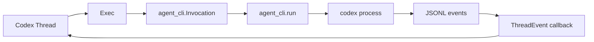
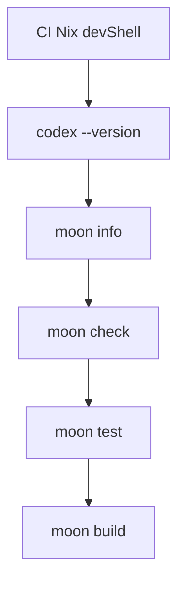

# Codex SDK for MoonBit

Embed the Codex agent in MoonBit workflows and applications.

This package is a direct MoonBit port of the official [`@openai/codex-sdk`](https://github.com/openai/codex/tree/f201c30c52a35f819262865a53df94b6f4ea7a50/sdk/typescript). It wraps the `codex` CLI and exchanges JSONL events over stdin and stdout.

The immutable upstream reference for this port is commit [`f201c30c52a35f819262865a53df94b6f4ea7a50`](https://github.com/openai/codex/tree/f201c30c52a35f819262865a53df94b6f4ea7a50/sdk/typescript). Every ported source process and test carries a comment linking to its corresponding file or line at that commit.

## Migration

This standalone release is a breaking package-path migration. Update existing `totto2727/codex-sdk` imports to `totto2727/codex-sdk/cli`; the standalone module starts at version `0.2.0`.

## Workspace usage

```mbt
import {
  "totto2727/codex-sdk/cli" @codex,
}
```

The `codex` executable must be available on `PATH` for native process execution, or supplied with `Options.executable_path_override`.

## Target support

| Surface | Native | Wasm |
| --- | --- | --- |
| Module and `src/cli` package | Supported | Supported |
| CI validation | Not run in CI | Preferred target |
| Codex subprocess execution | Uses the host process runtime | Requires a host/runtime process bridge |

The SDK declares both native and wasm support, while CI validates the `wasm` preferred target only. It keeps one target-neutral `src/cli` source and package. The process contract is supplied by `totto2727/agent-core-sdk/cli`; this module does not add target-specific source directories, packages, backends, or shims.

## Development shells

The default Nix development shell contains only the MoonBit toolchain. The CI shell derives from it and adds the Nix-managed `codex` executable for CI validation. The workflow uses the shared MoonBit actions from [`totto2727-org/monorepo@main`](https://github.com/totto2727-org/monorepo/tree/main/.github/actions).

```sh
nix develop
nix develop .#ci --command codex --version
```

## Quickstart

```mbt
async fn main {
  let client = @codex.Client::Client()
  let thread = client.start_thread()
  let turn = thread.run(
    @codex.Input::Prompt("Diagnose the test failure and propose a fix"),
  )
  println(turn.final_response)
}
```

Call `run` repeatedly on the same `Thread` value to continue that conversation.

## Streaming responses

MoonBit uses an asynchronous callback in place of TypeScript's `AsyncGenerator`. The callback receives the same structured event variants and remains inside the task that owns the Codex subprocess.

```mbt
thread.run_streamed(
  @codex.Input::Prompt("Diagnose the test failure"),
  async event => {
    match event {
      ItemCompleted(completed) => println("\{completed.item}")
      TurnCompleted(completed) => println("\{completed.usage}")
      _ => ()
    }
  },
)
```

Cancelling the MoonBit task that runs `run` or `run_streamed` cancels the Codex subprocess, which is the native equivalent of passing an `AbortSignal`.

## Structured output

Pass a JSON object as the per-turn output schema. The SDK writes it to a temporary file and forwards the path through `--output-schema`.

```mbt
let schema = Json::object({
  "type": "object",
  "properties": {
    "summary": Json::object({ "type": "string" }),
  },
  "required": ["summary"],
  "additionalProperties": false,
})
let turn = thread.run(
  @codex.Input::Prompt("Summarize repository status"),
  turn_options=@codex.TurnOptions::TurnOptions(output_schema=schema),
)
```

## TypeScript parity

The public event, item, option, thread, and turn models follow the official TypeScript SDK. MoonBit paths use `moonbitlang/x/path.Path`, task cancellation replaces `AbortSignal`, and streaming uses an async callback because the pinned MoonBit async runtime does not expose an async-generator type. Node's optional-package binary lookup is replaced by `PATH` lookup because a MoonBit package has no Node module-resolution context.

## Agent core integration

The provider depends directly on the single `totto2727/agent-core-sdk/cli` package from merged commit [`5bb57e3bb9bd5eeef2dc137f3899c13d115dc264`](https://github.com/totto2727-org/agent-core-sdk/commit/5bb57e3bb9bd5eeef2dc137f3899c13d115dc264). `Exec` owns Codex-specific argument construction and event conversion, while `agent_core_sdk/cli.run` owns the native JSONL process lifecycle. No target-specific `cli/native` package or backend is used.



The source layout follows the upstream files using MoonBit snake-case filenames:

| Upstream TypeScript   | MoonBit                  |
| --------------------- | ------------------------ |
| `codex.ts`            | `client.mbt`             |
| `codexOptions.ts`     | `options.mbt`            |
| `events.ts`           | `events.mbt`             |
| `exec.ts`             | `exec.mbt`               |
| `index.ts`            | `index.mbt`              |
| `items.ts`            | `items.mbt`              |
| `outputSchemaFile.ts` | `output_schema_file.mbt` |
| `thread.ts`           | `thread.mbt`             |
| `threadOptions.ts`    | `thread_options.mbt`     |
| `turnOptions.ts`      | `turn_options.mbt`       |

MoonBit-only files without a direct upstream module use descriptive names and document the corresponding upstream process and language or test-runtime requirement.

## Tests

Run the preferred-target package checks from the repository root:

```sh
moon check
moon test
moon build
```

The module still declares native and wasm support. Pass an explicit `--target` only when deliberately validating a declared non-preferred target locally.

The 37 upstream `abort`, `exec`, `run`, and `runStreamed` cases are ported one-for-one against a native fake Codex executable that records arguments, environment variables, stdin, schemas, JSONL events, process exits, and cancellation. Another 26 cases cover the explicit MoonBit item and event decoders, including every discriminated union branch, malformed payloads, unknown variants, and invalid JSONL. The Node-only optional-package layout cases are represented by documented MoonBit-runtime substitutions for an explicit executable override, `PATH` executable fallback, exact caller-provided `PATH`, and preservation of the Windows `Path` key.

## Test conditions


